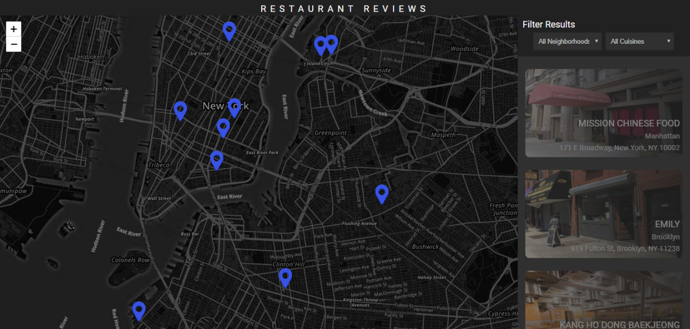
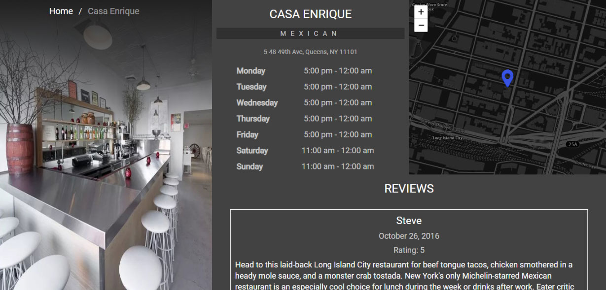
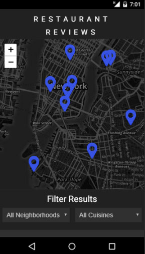
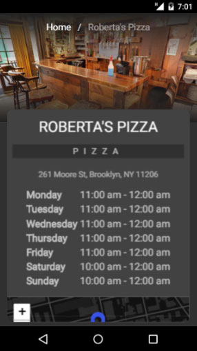

# Restaurant Reviews App - Stage 1 - Udacity

This is a project for the Udacity Front-End Nanodegree called **Restaurant Reviews App - Stage 1**.

## Usage

You can run the app locally.

If you want to run locally you have to download the app first:

### Method 1:

1. Click on the green `Clone or download` button above.

2. Click on `Download ZIP`.

3. Extract downloaded Zip file.

4. Run server via CMD with `python -m http.server`.

5. With your server running, visit the site: `http://localhost:8000`.

### Method 2:

1. If you have git installed you can clone this repo to your desktop by running this command line:
`git clone https://github.com/Al-Yasa/Restaurant-Reviews-App-Stage-1-Udacity.git`

2. Run server via CMD with `python -m http.server`.

3. With your server running, visit the site: `http://localhost:8000`.